# Arquitetura — Sistema de conteúdo Instagram da Pastoral do Dízimo

Data: 2026-09-25 · Fase 2 · Status: **aprovada pelo Diogo em 2026-09-25 com a Alt. C (plano Max, sem API paga)** — ver [ADR-001](decisoes/ADR-001-pipeline-lote-max.md)

Fontes: [docs/pesquisa.md](pesquisa.md) (cada fato tem link lá), [docs/marca/estrategia-instagram.md](marca/estrategia-instagram.md), [ADR-000](decisoes/ADR-000-premissas.md).

Convenção deste documento: números de tokens e R$ marcados **[H]** são hipóteses a medir no piloto; **[M]** são medidos; **[D]** vêm de documentação oficial.

## 0. Premissas fixadas
| Item | Valor | Origem |
|---|---|---|
| Aprovador | Diogo, único, técnico | ADR-000 |
| Ritmo | 3 posts iniciais + capas de destaques; depois **2 posts de feed/semana** | ADR-000 |
| Mídia | Imagem única e carrossel (2–10 slides), **1080×1350 (4:5)**, JPEG sRGB | Diogo + [D] |
| Reels/Stories | Fora do sistema (manuais) | ADR-000 |
| Fotos | Nenhuma no piloto; arte tipográfica/gráfica | ADR-000 |
| Repositório | GitHub **público** | Diogo |
| Domínio próprio | Não existe | Diogo |
| Canal de aprovação | **E-mail com link assinado**, um gate só | Diogo |
| Conta IG | Pessoal hoje → precisa virar profissional; sem Página FB → **Instagram Login** | pesquisa 00/01 |

## 1. Fluxo proposto

```mermaid
flowchart LR
  subgraph SEG["Segunda 06h · GitHub Action semanal (sem LLM exceto passo 2)"]
    A[pauta.py<br/>calendário litúrgico + rotação 70/20/10 + fila dos 30 posts] --> B[gerar.py<br/>1 chamada LLM, saída JSON validada]
    B --> C[lint.py<br/>checklist determinístico]
    C -->|reprova| B
    C --> D[render.py<br/>HTML/CSS → Playwright → JPEG 4:5 + QA visual]
    D --> E[preview.py<br/>feed simulado em site/ → GitHub Pages]
    E --> F[notificar.py<br/>e-mail com links HMAC]
  end
  F --> G{{Diogo clica<br/>Aprovar / Pedir ajuste}}
  G --> H[Cloudflare Worker<br/>valida HMAC → grava aprovacao.json assinado via GitHub API]
  H --> I[publicar.py<br/>cron diário: só publica se assinatura + hash da arte conferem]
  I --> J[(Instagram Graph API<br/>media → status → media_publish)]
  J --> K[metricas.py<br/>D+3, D+7, D+30]
  K --> L[analise.py mensal<br/>1 chamada LLM → PR no playbook]
  M[token.py semanal<br/>refresh_access_token] -.-> I
```



Princípio: **LLM em exatamente dois pontos** (geração semanal e análise mensal). Tudo o mais é código determinístico e testável.

### 1.1 Componentes (uma responsabilidade cada)
| Módulo | Faz | Entrada → Saída | LLM? |
|---|---|---|---|
| `calendario.py` | Páscoa (`dateutil.easter`), tempos, cores, solenidades, CF, datas fixas | ano → tabela | não |
| `pauta.py` | Escolhe os N posts da semana: rotação 70/20/10 (ciclo de 10: 7 Formação · 2 Vida pastoral · 1 Convite), fila dos 30 temas do documento, gancho litúrgico da semana | semana → `briefing.json` | não |
| `gerar.py` | Uma chamada à API com `output_config.format` (JSON Schema): para cada post, slides, legenda, alt-text, hashtags, **autocrítica com nota por critério da rubrica** e revisão se nota < 2 | `briefing.json` + `cartao-marca.md` → `posts.json` | **sim** |
| `lint.py` | Termos proibidos, tamanhos (legenda ≤ 1.500, ≤ 8 hashtags, slide ≤ 25 palavras), CTA da lista permitida, citação bíblica com referência válida, sem `%`, `is_carousel` 2–10 | `posts.json` → ok / lista de erros (até 1 regeneração automática) | não |
| `render.py` | Templates HTML/CSS com tokens da identidade; Playwright; **QA**: overflow (`scrollHeight>clientHeight`), contraste WCAG AA, área segura 4:5, dimensão exata, tamanho < 8 MB | `posts.json` → `render/*.jpg` + `qa.json` | não |
| `preview.py` | Página estática: grade do perfil simulada + cada post com carrossel navegável, legenda e botões | → `site/semanas/2026-W41/index.html` | não |
| `notificar.py` | E-mail com resumo + links assinados (`aprovar_tudo`, `aprovar_post`, `ajustar_post`), validade 7 dias | → e-mail | não |
| `worker/` (Cloudflare) | Valida HMAC + expiração, grava `aprovacao.json` **assinado com segredo próprio** via GitHub Contents API, responde página de confirmação; "ajustar" abre formulário → grava `ajuste.json` e dispara `repository_dispatch` para regenerar só aquele post | clique → commit | não |
| `publicar.py` | Portão: exige `aprovacao.json` com assinatura válida **e** `sha256` da arte/legenda igual ao aprovado **e** data ≥ agendada **e** não constar no ledger `publicado.json` (idempotência). Cria contêineres, faz poll de `status_code`, publica, grava ledger | → post no ar | não |
| `metricas.py` | Insights FEED confirmados (`views, reach, likes, comments, saved, shares, total_interactions, follows, profile_visits, reposts`) em D+3/D+7/D+30 | → `metricas/*.json` | não |
| `token.py` | `refresh_access_token` semanal; alerta se < 10 dias de validade | → secret atualizado via GitHub API (`PUT /repos/.../actions/secrets`) | não |
| `analise.py` | Mensal: agrega métricas por pilar/formato/horário; 1 chamada LLM (Sonnet 5 [H]) propõe ajustes ao `playbook.md`; abre PR | → PR | **sim** |
| `alertas` | `if: failure()` em todo workflow → e-mail; ausência do e-mail semanal também é detectável (heartbeat) | | não |

### 1.2 Estrutura do repositório
```
CLAUDE.md                     (≤ 40 linhas: como rodar, onde estão as regras)
cartao-marca.md               (destilado de docs/marca/, tamanho medido em tokens)
playbook.md                   (aprendizados; atualizado mensalmente por PR)
config.yaml                   (dias/horários, N posts/semana, hashtags fixas, CTAs permitidos)
src/pastoral/*.py             (módulos acima)  ·  tests/  ·  templates/  ·  worker/
content/semanas/2026-W41/{briefing,posts,aprovacao,publicado}.json + render/
site/                         (GitHub Pages: prévias e imagens públicas exigidas pela Meta)
docs/{pesquisa,arquitetura,relatorio-piloto}.md · docs/decisoes/ADR-*.md
.github/workflows/{semanal,publicar,metricas,token,mensal}.yml
```

### 1.3 Segredos (cadastrados pelo Diogo, nunca passam pelo Claude)
| Nome | Onde | Uso |
|---|---|---|
| `IG_ACCESS_TOKEN` | GitHub Secrets | Token longo do Instagram Login (renovado por `token.py`) |
| `IG_USER_ID` | GitHub Variables | ID da conta profissional |
| `ANTHROPIC_API_KEY` | GitHub Secrets | Geração e análise (rota API) |
| `RESEND_API_KEY` | GitHub Secrets | E-mail (modo sandbox envia só para o dono da conta = Diogo, suficiente) |
| `LINK_HMAC_SECRET` | GitHub Secrets **e** Worker | Assinar/validar links do e-mail |
| `APROVACAO_HMAC_SECRET` | GitHub Secrets **e** Worker | Assinar `aprovacao.json`; `publicar.py` valida |
| `GH_PAT_WORKER` | Worker | PAT fine-grained (contents: write só neste repo) para o Worker commitar |
| `GH_PAT_SECRETS` | GitHub Secrets | PAT para `token.py` atualizar `IG_ACCESS_TOKEN` |

## 2. Alternativas comparadas

### Alt. A — Lote único + templates (recomendada)
Uma chamada LLM gera a semana inteira em JSON; curadoria por lint + autocrítica na mesma chamada; arte por template.

### Alt. B — Cadeia enxuta de agentes em sessão Claude Code
3 subagentes (estrategista → redator → curador) rodando em sessão interativa no plano Max, 1×/semana, cada um lendo `cartao-marca.md`. Versão "leve" do sistema anterior.

### Alt. C — Lote único, executado em sessão Claude Code (Max) em vez de API
Mesmo pipeline de A, mas o passo 2 roda via `claude -p` (headless) com `CLAUDE_CODE_OAUTH_TOKEN` no GitHub Action, ou manualmente na sessão.

### 2.1 Tokens por semana (2 posts) — hipóteses a medir
| | A (API) | B (sessão Max, 3 subagentes) | C (claude -p, Max) |
|---|---|---|---|
| Contexto fixo por chamada | cartão 2,5k + skill/schema 2k + sistema 1k = **5,5k** [H] | idem + **prompt de sistema do Claude Code + ferramentas ≈ 15–20k por subagente** [H, explica os 84k/chamada medidos no sistema anterior] | 5,5k + overhead do Claude Code ≈ 20k [H] |
| Briefing + saída | 1,5k in + **4k out** (2 posts com autocrítica) [H] | 3 × (1,5k in + 3k out) + releituras de artefatos intermediários ≈ 25k [H] | 1,5k in + 4k out |
| **Total/semana** | **≈ 11k tokens** | **≈ 80–100k tokens** | **≈ 26k tokens** |
| Análise mensal | 25k in + 3k out (Sonnet 5) [H] | idem em sessão ≈ 50k | idem ≈ 45k |

### 2.2 Custo mensal (4,33 semanas) — preços oficiais [D], câmbio **hipótese R$ 5,50/US$** (Anthropic cobra em USD; não há preço oficial em BRL)
| Rota | Cálculo | US$/mês | R$/mês [H câmbio] |
|---|---|---|---|
| **A — API, Opus 5.5, sem Batch** | 4,33 × (7k×$4 + 4k×$20)/1M + análise (25k×$2 + 3k×$10)/1M | **0,55** | **≈ 3,0** |
| A — API, Opus 5.5, **com Batch** | 50% do acima na geração | 0,31 | ≈ 1,7 |
| A — API, Sonnet 5 | 4,33 × (7k×$2 + 4k×$10)/1M + análise | 0,31 | ≈ 1,7 |
| A — API, Fable 5.1 (só se qualidade exigir) | 4,33 × (7k×$10 + 4k×$50)/1M + análise | 1,25 | ≈ 6,9 |
| B — sessão Max | incluído no plano (US$ 100+/mês já pago); consome ≈ 400k tokens/mês da cota | 0 marginal | 0 marginal |
| C — `claude -p` com Max no Action | incluído no plano; ≈ 110k tokens/mês da cota; risco R5 (Termos de Uso) | 0 marginal | 0 marginal |
| Plano Pro isolado (referência do brief) | US$ 20/mês; cota de 5 h observada ~44k tokens no sistema anterior → A cabe (11k), B não | 20 | ≈ 110 |
| Infra (GitHub público, Pages, Cloudflare Worker free, Resend free) | | **0** | 0 |

Leitura: na rota API, **o custo de tokens é desprezível (< R$ 10/mês em qualquer modelo)**. O Batch economiza ~R$ 1/mês e acrescenta até 24 h de latência e um poll — **não compensa**; prompt caching também não (1 chamada/semana, TTL de 5 min/1 h). A decisão real é **API (custo ínfimo, auditável, 100% automático, sem risco de Termos) versus reaproveitar o Max (custo zero marginal, mas exige sessão manual ou depende do OAuth token em CI)**.

### 2.3 Trabalho manual por semana
| | A | B | C |
|---|---|---|---|
| Abrir Claude Code | não | **sim (~10 min + espera)** | não (se OAuth em CI) |
| Aprovar | 1 e-mail, ver prévia (~5 min), **1 clique** (aprovar tudo) ou 1 por post | igual | igual |
| Ajustes | formulário no link → regeneração automática do post | igual | igual |
| **Total** | **~5 min, 1–2 cliques** | ~15 min | ~5 min |

### 2.4 Riscos e qualidade esperada
| | A | B | C |
|---|---|---|---|
| Qualidade do texto | Depende de 1 modelo + autocrítica; **mitigação: rubrica + lint + regeneração**; piloto compara Opus 5.5 × Sonnet 5 | Curador separado pode pegar mais, mas o sistema anterior não provou ganho proporcional ao custo 8× | = A |
| Falha silenciosa | Alerta por e-mail em qualquer job; heartbeat | Depende de humano rodar | = A |
| Compliance | Nenhum risco | Nenhum | **R5**: Termos de Uso do plano para automação |
| Dependência de cota | Nenhuma | Janela de 5 h / semanal do plano | idem |

### 2.5 Recomendação
**Alt. A na rota API** para produção, com **Opus 5.5** como padrão e Sonnet 5 testado no piloto (se a rubrica empatar, Sonnet). Claude Code (Max) fica para desenvolvimento, para o piloto medido e para revisar o PR mensal do playbook — onde há humano no loop de qualquer forma. Pré-requisito: Diogo criar chave de API com crédito mínimo (o tier inicial exige depósito; valor **NÃO VERIFICADO** oficialmente — checar no console).

Se o Diogo preferir não abrir conta de API, a Alt. C é o fallback (mesmo código; troca-se só o cliente de geração), aceitando o risco R5.

## 3. Orçamento de tokens por etapa (metas a confirmar no piloto)
| Etapa | Modelo | Input | Output | Frequência |
|---|---|---|---|---|
| Geração semanal (2 posts) | Opus 5.5 | ≤ 8k | ≤ 5k | semanal |
| Regeneração de 1 post (ajuste ou lint) | Opus 5.5 | ≤ 6k | ≤ 2,5k | eventual |
| Análise mensal | Sonnet 5 | ≤ 30k | ≤ 4k | mensal |
| Cartão de marca | — | **medido com `count_tokens` (grátis)**; meta ≤ 3k | — | uma vez |
| Tudo o mais | nenhum | 0 | 0 | — |

## 4. Rubrica de qualidade (derivada de docs/marca/)
Escala 0–2 por critério. **Aprovado** = todos os automáticos passam **e** média humana ≥ 1,6 **e** nenhum 0.

### 4.1 Texto
| # | Critério | Fonte na estratégia | Verificação |
|---|---|---|---|
| T1 | Tom acolhedor, catequético, sem cobrança, culpa, urgência ou "retorno" | cap. 3, 16 | **auto** (lint de termos) + humano |
| T2 | Fundamento: citação bíblica/Catecismo/CIC correta, com referência (livro cap,vers.) | cap. 1, 3, 9 | **auto** (formato) + humano (exatidão) |
| T3 | Pilar (70/20/10) e público do briefing respeitados | cap. 2, 9 | auto (campo) + humano |
| T4 | Clareza: 1 ideia por slide, frases curtas, jargão explicado | cap. 3, 13 | auto (≤ 25 palavras/slide) + humano |
| T5 | CTA único, da lista permitida (salvar, compartilhar, comentar, marcar, enviar dúvida, inscrever-se) — nunca "contribua/doe" | cap. 11 | **auto** |
| T6 | Doutrina: sem percentual obrigatório, sem prosperidade, sem dados financeiros não confirmados | cap. 16, CIC cân. 222, CIC 2043 | **auto** (regex) + humano |
| T7 | Legenda: primeira linha forte, ≤ 1.500 caracteres, 3–8 hashtags, alt-text descritivo (≤ 1.000) | cap. 15 (acessibilidade), [D] limites | **auto** |
| T8 | Identidade institucional: assina como Pastoral do Dízimo – Arquidiocese de Florianópolis; comunhão com o clero | cap. 2, 5 | auto (assinatura) + humano |

### 4.2 Arte
| # | Critério | Fonte | Verificação |
|---|---|---|---|
| A1 | 1080×1350, JPEG sRGB, < 8 MB, todos os slides na mesma proporção | [D] | **auto** |
| A2 | Nenhum texto estoura a caixa; margens de segurança ≥ 72 px | cap. 4 ("composições limpas") | **auto** (DOM) |
| A3 | Contraste texto/fundo ≥ 4,5:1 (WCAG AA) | cap. 15 (acessibilidade) | **auto** |
| A4 | ≤ 25 palavras por slide; título legível em miniatura (≥ 56 px em 1080) | cap. 16 ("excesso de texto") | **auto** |
| A5 | Só cores e fontes dos tokens da identidade; serifada em títulos, sem serifa em apoio | cap. 4 | **auto** (template) |
| A6 | Marca presente (assinatura/logo) e capa de carrossel com gancho | cap. 4, 8 | auto (slot) + humano |
| A7 | Sobriedade: sem estética publicitária, sem foto de pessoa, sem imagem por IA | cap. 4, 15, LGPD | humano (template impede foto por construção) |

## 5. Portão de aprovação — imposto por código
1. `publicar.py` **não tem caminho** que publique sem `aprovacao.json`.
2. `aprovacao.json` carrega `HMAC-SHA256(APROVACAO_HMAC_SECRET, canonical_json)`; o script recalcula e compara com `hmac.compare_digest`. Um commit manual de "aprovado" sem o segredo é rejeitado.
3. O arquivo aprovado guarda `sha256` de cada JPEG e da legenda; qualquer alteração posterior invalida a aprovação (o que foi visto é o que sai).
4. Links do e-mail expiram em 7 dias; Worker rejeita reuso (nonce gravado no próprio `aprovacao.json`).
5. Ledger `publicado.json` (com `ig_media_id`) impede republicação; `workflow` usa `concurrency` para não rodar em paralelo.
6. Modo `--dry-run` padrão em todo ambiente que não seja o Action agendado com `PUBLICAR=1`.

## 6. Plano de testes
| Nível | O que | Como |
|---|---|---|
| Unitário | `calendario.py` × datas conhecidas 2026–2027 (Páscoa, Cinzas, Pentecostes, Corpus Christi, Advento) | pytest, tabela fixa |
| Unitário | `lint.py`: cada regra com caso que passa e que falha (termos, %, CTA, hashtags, tamanho) | pytest |
| Unitário | Schema de `posts.json` (jsonschema) rejeita saída malformada | pytest |
| Unitário | HMAC: assinar/validar, expiração, adulteração de 1 byte, nonce reusado | pytest (Python) + `wrangler dev`/vitest (Worker) |
| **Unitário — gate** | `publicar.py` recusa: sem arquivo · assinatura inválida · hash divergente · data futura · já publicado. Aprova só o caso íntegro. **Cliente da Meta mockado**; teste falha se `media_publish` for chamado em qualquer caso negativo | pytest |
| Integração | `render.py` sobre fixtures: overflow proposital detectado; contraste baixo detectado; dimensões exatas | pytest + Playwright |
| Integração | Fluxo semanal completo em `--dry-run` com LLM mockado (fixture de `posts.json`) gerando prévia | pytest |
| Contrato | `metricas.py` só pede métricas da lista confirmada; resposta 400 registra e não derruba o job | pytest com respostas gravadas |
| Piloto | Semana real: tokens/tempo medidos por etapa, rubrica por post, prévia ao Diogo, publicação só com aprovação explícita | `docs/relatorio-piloto.md` |

## 7. Entregas da Fase 3 (fatias verticais, cada uma com teste + ADR)
1. Cartão de marca + tokens medidos · 2. Calendário + pauta · 3. Geração com schema + lint · 4. Templates + render + QA (**depende da identidade visual aprovada**) · 5. Prévia + e-mail · 6. Worker de aprovação · 7. Portão de publicação + cliente Meta · 8. Métricas + token refresh · 9. Análise mensal · 10. README operacional.

Em paralelo à sua revisão desta arquitetura, entrego o **estudo de identidade visual e logotipo** (ADR próprio), pré-requisito da fatia 4.

## 8. Decisões do Diogo (2026-09-25)
1. **Alt. C escolhida:** pipeline da Alt. A, geração executada por `claude -p` com o plano **Max** (`CLAUDE_CODE_OAUTH_TOKEN` gerado por `claude setup-token`), não pela API paga. Consequências: o passo `gerar.py` invoca o CLI e lê tokens/custo do JSON de saída ([medição 05](pesquisa/05-medicoes-locais.md)); risco R5 (Termos de Uso) fica registrado e é monitorado; se um dia o OAuth em CI deixar de ser suportado, troca-se só o cliente de geração pela API.
2. Chave de API: **não será criada.**
3. Publicação: **terça e sexta, 19h (America/Sao_Paulo)**, ajustável em `config.yaml`.
4. Commits autorizados a cada fase.

### 8.1 Pendências originais (mantidas para referência)
1. Aprovar a Alt. A + rota API (ou escolher C).
2. Se API: criar chave em console.anthropic.com com crédito (cadastrar `ANTHROPIC_API_KEY`).
3. Dias/horários de publicação — proposta inicial: **terça e sexta, 19h (Brasília)** [H a ajustar por métricas].
4. Trocar a conta para profissional (Comercial › Organização religiosa) e criar o app na Meta (tipo Business) — passo a passo virá na Fase 3.
5. Criar conta Resend com o e-mail que receberá as aprovações (sandbox envia só ao dono da conta) e conta Cloudflare (Worker free, sem domínio).
